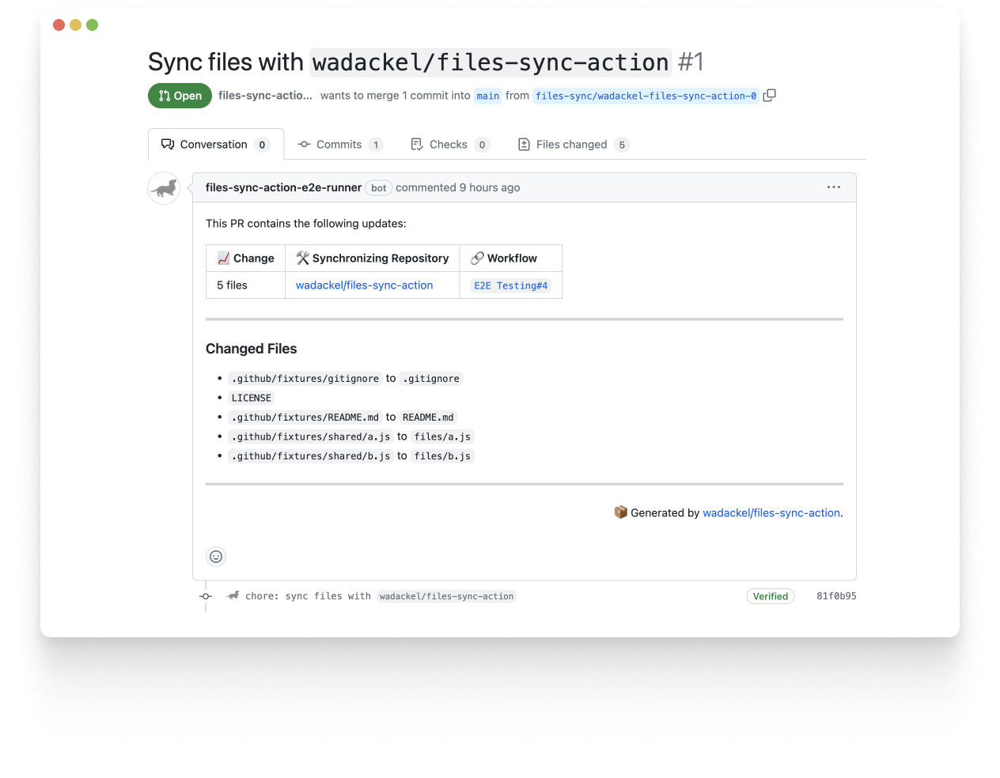

<div align="center">

# :package: Files Sync Action

<!-- gha-description-start -->

A customizable action that synchronizes files across multiple repositories.

<!-- gha-description-end -->

[![Build][badge-build]][build]
[![MIT LICENSE][badge-license]][license]
[![code style: prettier][badge-prettier]][prettier]
[![semantic-release: angular][badge-semantic-release]][semantic-release]

</div>

`files-sync-action` is a GitHub Action that synchronizes files across multiple repositories based on a configuration file written in YAML. It is useful in cases where you want to unify files, such as various tool configuration files or workflow files, across repositories. There are various patterns for motivation to synchronize files, depending on the team. To support these use cases, it allows for detailed configuration.

<div align="center">

The following links are the actual PR and Workflow execution result logs:

[Actual PR][demo-pr]



</div>

## Features

- :arrows_counterclockwise: Create PRs to synchronize files and directories across multiple repositories
- :hammer_and_wrench: Support flexible configuration of reviewers and labels for PRs
- :checkered_flag: Supports stable file synchronization even in large repositories.
- :pencil: Support file customization using [EJS][ejs]
- :recycle: Supports the deletion of files and folders

## Usage

In this section, we explain the most common usage of `files-sync-action`. To start using it, simply create a Workflow file that runs `files-sync-action` and a configuration file, as shown below:

`.github/workflows/files-sync.yaml`

```yaml
name: Sync Files
on:
  push:
    branches:
      - main
  workflow_dispatch:
jobs:
  sync:
    runs-on: ubuntu-latest
    steps:
      - uses: actions/checkout@v4
      - uses: wadackel/files-sync-action@v3
        with:
          github_token: ${{ secrets.GH_FILES_SYNC_TOKEN }}
```

<details>
<summary>GitHub App Tokens (with <a href="https://github.com/actions/create-github-app-token">actions/create-github-app-token</a>)</summary>

```yaml
name: Sync Files
on:
  push:
    branches:
      - main
  workflow_dispatch:
jobs:
  sync:
    runs-on: ubuntu-latest
    steps:
      - uses: actions/checkout@v4
      - name: Generate token
        id: generate_token
        uses: actions/create-github-app-token@v2
        with:
          app-id: ${{ secrets.GH_APP_ID }}
          private-key: ${{ secrets.GH_APP_PRIVATE_KEY }}
          # Optional: Set the permissions for the token (e.g. "owner", "repositories")
      - uses: wadackel/files-sync-action@v3
        with:
          github_token: ${{ steps.generate_token.outputs.token }}
```

</details>

`.github/files-sync-config.yaml`

```yaml
settings:
  pull_request:
    reviewers:
      - 'wadackel'
    labels:
      - 'files-sync'

patterns:
  - files:
      - tsconfig.json
      - .prettierrc.json
      - from: workflows/ci.yaml
        to: .github/workflows/ci.yaml
    delete_files:
      - a-file-to-delete.md
      - path: a/folder/to/delete
        type: directory
    repositories:
      - owner/repo1
      - owner/repo2@target_branch
```

If you need more customization, please refer to the [Sync Configuration](#sync-configuration) section.

### Authentication

`files-sync-action` supports authentication using both Personal Access Tokens and GitHub Apps.

We recommend using [Fine-grained personal access tokens][fine-grained-pat] for Personal Access Token authentication, as they allow for more granular access control compared to traditional tokens. Authentication using GitHub Apps is useful for team development.

To use `files-sync-action`, you need to set the following `Repository permissions` for each respective token:

| Type              | Permission                                                          |
| :---------------- | :------------------------------------------------------------------ |
| **Contents**      | `Read and write`                                                    |
| **Pull requests** | `Read and write`                                                    |
| **Metadata**      | `Read and write`                                                    |
| **Workflows**     | To synchronize Workflow files: `Read and write`, Other: `No access` |

## Inputs

<!-- gha-inputs-start -->

### `github_token`

**Required:** `true`  
**Default:** n/a

Personal Access Token to use to create file sync and PR. Required if `GITHUB_APP_*` is not specified.

### `github_api_url`

**Required:** `false`  
**Default:** `https://api.github.com`

API URL of the GitHub server.

### `config_file`

**Required:** `false`  
**Default:** `.github/files-sync-config.yaml`

The path for the sync configuration file.

<!-- gha-inputs-end -->

## Outputs

<!-- gha-outputs-start -->

### `pull_request_urls`

URL array of PRs created to synchronize files.

### `synced_files`

An array of all synchronized file names.

<!-- gha-outputs-end -->

## Sync Configuration

The configuration file for file synchronization can be written in YAML. By default, it refers to `.github/files-sync-config.yaml`. If you want to change the path, please modify the value of `inputs.config_file`.

The configuration file consists of a `settings` section, which defines common settings, and a `patterns` section, which defines individual file synchronization patterns. The contents defined in `settings` are inherited by all `patterns`.

| Key        | Required | Type                   | Description                                                           |
| :--------- | :------- | :--------------------- | :-------------------------------------------------------------------- |
| `settings` | `false`  | [SettingsConfig]       | Settings to be used commonly across all file synchronization patterns |
| `patterns` | `true`   | Array<[PatternConfig]> | File synchronization patterns                                         |

### `SettingsConfig`

Configure the settings to be used commonly across all file synchronization patterns. You can customize the default commit and branch settings, as well as the contents of the PR.

| Key            | Required | Type                | Description                                             |
| :------------- | :------- | :------------------ | :------------------------------------------------------ |
| `commit`       | `false`  | [CommitConfig]      | Various settings related to commits                     |
| `branch`       | `false`  | [BranchConfig]      | Various settings related to branches                    |
| `pull_request` | `false`  | [PullRequestConfig] | Various settings related to automatically generated PRs |

**Defaults:**

```yaml
settings:
  commit:
    # defaults to "chore: sync files with `owner/repo`"
    format: '<%- prefix %>: <%- subject %>'
    prefix: 'chore'
    subject: 'sync files with `<%- repository %>`'
  branch:
    # defaults to "files-sync/owner-repo-0"
    format: '<%- prefix %>/<%- repository %>-<%- index %>'
    prefix: 'files-sync'
  pull_request:
    disabled: false
    force: true
    title: 'Sync files with `<%- repository %>`'
    body: |
      This PR contains the following updates:

      | :chart_with_upwards_trend: Change | :hammer_and_wrench: Synchronizing Repository | :link: Workflow |
      | :-- | :-- | :-- |
      | <%- changes.length %> files | [<%- repository %>](<%- github %>/<%- repository %>) | [\`<%- workflow %>#<%- run.number %>\`](<%- run.url %>) |

      ---

      ### Changed Files

      <%_ for (const file of changes) { -%>
      - <% if (file.from === file.to) { %>\`<%- file.to %>\`<% } else { %>\`<%- file.from %>\` to \`<%- file.to %>\`<% }%>
      <%_ } -%>
    reviewers: []
    assignees: []
    labels: []
    merge:
      mode: disabled
      strategy: merge
      delete_branch: false
      commit: ~
```

### `PatternConfig`

Configure the synchronization pattern for files and directories and the target repositories for synchronization. While inheriting the contents defined in `settings`, you can customize the commit, branch, and PR settings for each synchronization pattern.

| Key            | Required | Type                                | Description                                                                                           |
| :------------- | :------- | :---------------------------------- | :---------------------------------------------------------------------------------------------------- |
| `files`        | `true`   | Array<string \| [FileConfig]>       | List of files to synchronize. Supports files and directories.                                         |
| `delete_files` | `true`   | Array<string \| [DeleteFileConfig]> | List of files or directories to delete from repositories the specified repositories.                  |
| `repositories` | `true`   | Array<string>                       | List of repositories (optionally with target branches) to synchronize the files specified in `files`. |
| `commit`       | `false`  | [CommitConfig]                      | Various settings related to commits                                                                   |
| `branch`       | `false`  | [BranchConfig]                      | Various settings related to branches                                                                  |
| `pull_request` | `false`  | [PullRequestConfig]                 | Various settings related to automatically generated PRs                                               |
| `template`     | `false`  | Record<string, any>                 | Template variables to use for the files specified in `files`. Disables [EJS][ejs] if not specified    |

**Examples:**

```yaml
patterns:
  - files:
      - tsconfig.json # file (simple)
      - from: workflows/ci.yaml # file (details)
        to: .github/workflows/ci.yaml
      - from: shared # directory
        to: shared
        exclude:
          - '*.txt'
    repositories:
      - owner/repo1 # Uses repo1's default branch as the target branch
      - owner/repo2@target # Uses 'target' as the target branch
      - owner/repo3@feature/target # Uses 'feature/target' as the target branch
    commit:
      prefix: 'build'
    pull_request:
      reviewers:
        - 'team:team_slug'
        - 'login_name'
      labels:
        - 'A-build'
```

### `FileConfig`

Configure the details of the files to synchronize. When synchronizing a directory, you can use `exclude` to exclude only certain file patterns.

| Key       | Required | Type       | Description                                                                                                                                 |
| :-------- | :------- | :--------- | :------------------------------------------------------------------------------------------------------------------------------------------ |
| `from`    | `true`   | `string`   | Source file or directory path for synchronization                                                                                           |
| `to`      | `true`   | `string`   | Destination file or directory path for synchronization                                                                                      |
| `exclude` | `false`  | `string[]` | Glob patterns of files to exclude from the contents of a directory (only valid for directories). Glob patterns use [micromatch][micromatch] |

### `DeleteFileConfig`

Configure the details of the files to delete.

When a string is provided (no path neither type), the implementation assumes the path is a file.

| Key    | Required | Type     | Description                                                      |
| :----- | :------- | :------- | :--------------------------------------------------------------- |
| `path` | `true`   | `string` | Path to the element to delete in the target repository           |
| `type` | `true`   | `string` | Indicate whether the file to delete is a `directory` or a `file` |

### `CommitConfig`

Configure the commit contents to use when synchronizing files.

| Key       | Required | Type     | Description                                           |
| :-------- | :------- | :------- | :---------------------------------------------------- |
| `format`  | `false`  | `string` | Commit message format. Supports [EJS][ejs] templates  |
| `prefix`  | `false`  | `string` | Commit message prefix                                 |
| `subject` | `false`  | `string` | Commit message subject. Supports [EJS][ejs] templates |

The following template variables are available for various keys:

#### `commit.format`

| Key          | Type     | Description                                                                |
| :----------- | :------- | :------------------------------------------------------------------------- |
| `prefix`     | `string` | Commit message prefix specified in [`commit.prefix`][CommitConfig]         |
| `subject`    | `string` | Commit message subject specified in [`commit.subject`][CommitConfig]       |
| `repository` | `string` | Source repository name (the repository where the Action is being executed) |
| `index`      | `number` | Index of the file synchronization pattern                                  |

#### `commit.subject`

| Key          | Type     | Description                                                                |
| :----------- | :------- | :------------------------------------------------------------------------- |
| `repository` | `string` | Source repository name (the repository where the Action is being executed) |
| `index`      | `number` | Index of the file synchronization pattern                                  |

### `BranchConfig`

Configure the branch to commit to when synchronizing files.

| Key      | Required | Type     | Description                                       |
| :------- | :------- | :------- | :------------------------------------------------ |
| `format` | `false`  | `string` | Branch name format. Supports [EJS][ejs] templates |
| `prefix` | `false`  | `string` | Prefix for the branch name                        |

The following template variables are available for various keys:

#### `branch.format`

| Key          | Type     | Description                                                                                                       |
| :----------- | :------- | :---------------------------------------------------------------------------------------------------------------- |
| `prefix`     | `string` | Branch name prefix specified in [branch.prefix][BranchConfig]                                                     |
| `repository` | `string` | Source repository name (the repository where the Action is being executed), encoded in a valid branch name format |
| `index`      | `number` | Index of the file synchronization pattern                                                                         |

### `PullRequestConfig`

| Key         | Required | Type          | Description                                                                                                                                                                                 |
| :---------- | :------- | :------------ | :------------------------------------------------------------------------------------------------------------------------------------------------------------------------------------------ |
| `disabled`  | `false`  | `boolean`     | Flag to disable PR when synchronizing files. If disabled, file synchronization will only push without creating a PR                                                                         |
| `force`     | `false`  | `boolean`     | Flag to create a commit from **base** of existing PR and override existing commits. If disabled, the commit is created from **head** of existing PR and existing commits are not overridden |
| `title`     | `false`  | `string`      | Title of the automatically generated PR. Supports [EJS][ejs] templates                                                                                                                      |
| `body`      | `false`  | `string`      | Content of the automatically generated PR. Supports [EJS][ejs] templates                                                                                                                    |
| `reviewers` | `false`  | `string[]`    | List of reviewers to set for the automatically generated PR. To specify a team as a reviewer, add `team:` as a prefix to the team slug                                                      |
| `assignees` | `false`  | `string[]`    | List of assignees to set for the automatically generated PR. Team assignment is not supported                                                                                               |
| `labels`    | `false`  | `string[]`    | List of labels to set for the automatically generated PR                                                                                                                                    |
| `merge`     | `false`  | [MergeConfig] | Various settings related to merging the automatically generated PR                                                                                                                          |

The following template variables are available for various keys:

#### `pull_request.title`

| Key          | Type     | Description                                                                |
| :----------- | :------- | :------------------------------------------------------------------------- |
| `repository` | `string` | Source repository name (the repository where the Action is being executed) |
| `index`      | `number` | Index of the file synchronization pattern                                  |

#### `pull_request.body`

| Key          | Type                             | Description                                                                |
| :----------- | :------------------------------- | :------------------------------------------------------------------------- |
| `github`     | `string`                         | GitHub server URL                                                          |
| `repository` | `string`                         | Source repository name (the repository where the Action is being executed) |
| `workflow`   | `string`                         | Name of the Workflow running the Action                                    |
| `run`        | `object`                         | Object related to the Workflow execution                                   |
| `run.id`     | `string`                         | Execution ID of the Workflow                                               |
| `run.number` | `string`                         | Execution number of the Workflow                                           |
| `run.url`    | `string`                         | URL of the Workflow execution log                                          |
| `changes`    | `{ from: string; to: string }[]` | List of changed files                                                      |
| `index`      | `number`                         | Index of the file synchronization pattern                                  |

### `MergeConfig`

Configure the merge of the automatically generated PR when synchronizing files.

| Key             | Required | Type            | Description                                                                                                                      |
| :-------------- | :------- | :-------------- | :------------------------------------------------------------------------------------------------------------------------------- |
| `mode`          | `false`  | [MergeMode]     | The mode under which the PR merge is configured                                                                                  |
| `strategy`      | `false`  | [MergeStrategy] | The strategy to use for merging the automatically generated PR                                                                   |
| `delete_branch` | `false`  | `boolean`       | Flag to delete the synchronization branch if the automatically generated PR is successfully merged (ignored if `modw` is 'auto') |
| `commit`        | `false`  | [CommitConfig]  | Various settings related to merge commits                                                                                        |

### `MergeMode`

| Enumerator  | Description                                                                                                                           |
| :---------- | :------------------------------------------------------------------------------------------------------------------------------------ |
| `disabled`  | The PR is not merged                                                                                                                  |
| `immediate` | If possible, the PR is merged immediately                                                                                             |
| `auto`      | Same as `immediate`, but the PR is marked as "auto-merge" if it cannot be immediately merged                                          |
| `admin`     | Same as `immediate`, but PRs that are blocked due to repo policy are forcefully merged if the provided token has permissions to do so |

### `MergeStrategy`

| Enumerator | Description                                                                  |
| :--------- | :--------------------------------------------------------------------------- |
| `merge`    | Creates a merge commit                                                       |
| `rebase`   | Adds all synchronization commits to the target branch without a merge commit |
| `squash`   | Squashes all synchronization commits into one merge commit                   |

## Credits

`files-sync-action` is inspired by the following GitHub Actions. Thanks!!

- [BetaHuhn/repo-file-sync-action](https://github.com/BetaHuhn/repo-file-sync-action)
- [adrianjost/files-sync-action](https://github.com/adrianjost/files-sync-action)

## Development

Introducing the steps for developing `files-sync-action`.

### Setup

Using a Node.js Version Manager such as `asdf` or `nodenv`, activate the version of Node.js written in `.node-version`.

Next, activate `pnpm` using `corepack`, and install the dependent packages.

```bash
$ corepack enable pnpm
$ pnpm i
```

### Local Testing

Introducing cases where you want to verify the operation of `files-sync-action` on your local machine during development.

Create a configuration file for local testing and a script for running tests. These files are excluded from Git management by `.gitignore`.

```bash
$ touch test.yaml test.js
```

Customize the contents of each created file.

`test.js`

```javascript
process.env['INPUT_GITHUB_TOKEN'] = '...';
process.env['INPUT_CONFIG_FILE'] = 'test.yaml';
process.env['INPUT_GITHUB_API_URL'] = 'https://api.github.com';
process.env['GITHUB_SERVER_URL'] = 'https://github.com';
process.env['GITHUB_REPOSITORY'] = 'local/test';
process.env['GITHUB_RUN_ID'] = '0';
process.env['GITHUB_RUN_NUMBER'] = '0';
await import('./dist/index.js');
```

`test.yaml`

```yaml
patterns:
  - files:
      - README.md
      # ...
    repositories:
      - your/repo
```

To modify the implementation of `files-sync-action` and verify it on your local machine, build the script locally and run it using the configuration file created for testing.

```bash
$ pnpm build && node test.js
```

## LICENSE

[MIT © wadackel][license]

[badge-build]: https://img.shields.io/github/actions/workflow/status/wadackel/files-sync-action/ci.yaml?style=for-the-badge
[badge-license]: https://img.shields.io/github/license/wadackel/files-sync-action?style=for-the-badge
[badge-prettier]: https://img.shields.io/badge/code_style-prettier-ff69b4.svg?style=for-the-badge
[badge-semantic-release]: https://img.shields.io/badge/semantic--release-angular-e10079?logo=semantic-release&style=for-the-badge
[build]: https://github.com/wadackel/files-sync-action/actions/workflows/ci.yaml
[license]: ./LICENSE
[prettier]: https://github.com/prettier/prettier
[semantic-release]: https://github.com/semantic-release/semantic-release
[ejs]: https://ejs.co
[micromatch]: https://github.com/micromatch/micromatch
[fine-grained-pat]: https://docs.github.com/en/authentication/keeping-your-account-and-data-secure/creating-a-personal-access-token#creating-a-fine-grained-personal-access-token
[demo-pr]: https://github.com/wadackel/files-sync-action-sandbox1/pull/1
[demo-workflow-log]: https://github.com/wadackel/files-sync-action/actions/runs/4740171900/jobs/8415765398
[SettingsConfig]: #settingsconfig
[PatternConfig]: #patternconfig
[CommitConfig]: #commitconfig
[BranchConfig]: #branchconfig
[PullRequestConfig]: #pullrequestconfig
[MergeConfig]: #mergeconfig
[MergeMode]: #mergemode
[MergeStrategy]: #mergestrategy
[FileConfig]: #fileconfig
